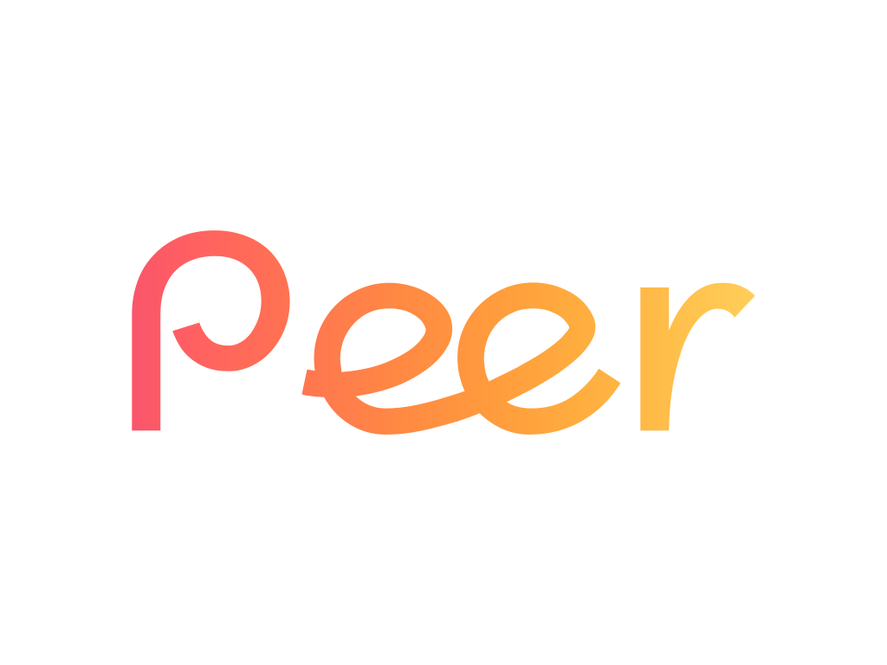

 

  
"Peer" is a modern social media platform where you can share your world through photos and videos while connecting with others in real time. Post content, engage in conversations through comments, and discover what your peers are sharing—all in one simple, interactive space designed to keep you connected and expressive.
